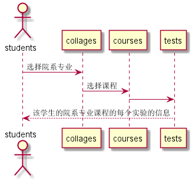

<!-- markdownlint-disable MD033-->
<!-- 禁止MD033类型的警告 https://www.npmjs.com/package/markdownlint -->

# “查看实验”用例 [返回](../README.md)
## 1. 用例规约

|用例名称|查看实验|
|-------|:-------------|
|功能|学生查看自己的老师发布的实验|
|参与者|学生|
|前置条件|学生需要先登录|
|后置条件| |
|主事件流| |
|备选事件流| |

## 2. 业务流程（顺序图） [源码](../src/sequence查看实验.puml)
 

## 3. 界面设计
- 界面参照: https://para-paradise.github.io/is_analysis/test6/ui/实验查看.html
- API接口调用
    - 接口1：[getOneTests](../接口/getOneTest.md)
        
        用于显示实验
	
	- 接口2：[getCollages](../接口/getCollages.md)
        
        用于显示一个学生的院系专业
## 4. 算法描述
    无
    
## 5. 参照表
- [STUDENTS](../src/数据库设计.md/#STUDENTS)
- [GRADES](../src/数据库设计.md/#GRADES)
- [TESTS](../src/数据库设计.md/#TESTS)
- [COLLAGES](../src/数据库设计.md/#TESTS)
- [COURSES](../src/数据库设计.md/#TESTS)